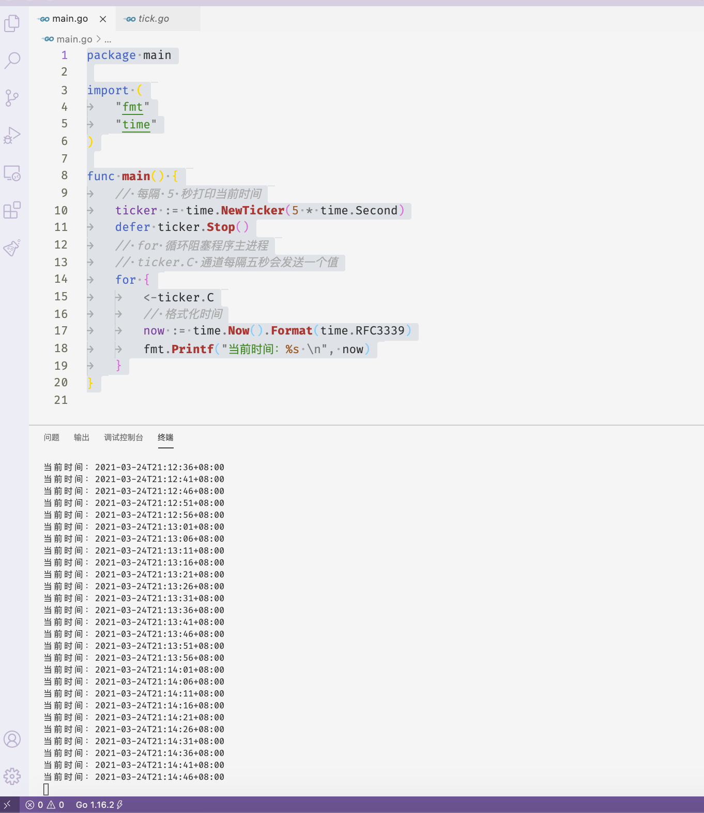

# 学习篇-基础


<!--more-->

这一篇主要介绍如何编写一个简单的 `go` 程序，并将它注册成为一个 `windows` 系统服务。
文章源码地址：[https://www.github.com/snowlyg/learns](https://www.github.com/snowlyg/learns)

#### 简单程序

```go
package main

import (
	"fmt"
	"time"
)

func main() {
	// 每隔 5 秒打印当前时间
	ticker := time.NewTicker(5 * time.Second)
	defer ticker.Stop()
	// for 循环阻塞程序主进程
	// ticker.C 通道每隔五秒会发送一个值
	for {
		<-ticker.C
		// 格式化时间
		now := time.Now().Format(time.RFC3339)
		fmt.Printf("当前时间：%s \n", now)
	}
}

```

在终端执行 `go run main.go `,每隔5秒钟会打印打印出当前的时间：



#### 打包 exe 执行文件

运行 `go build -o myservice.exe main.go ` 将程序打包成 exe 执行文件。项目目录下会生成一个 myservice.exe 文件。


