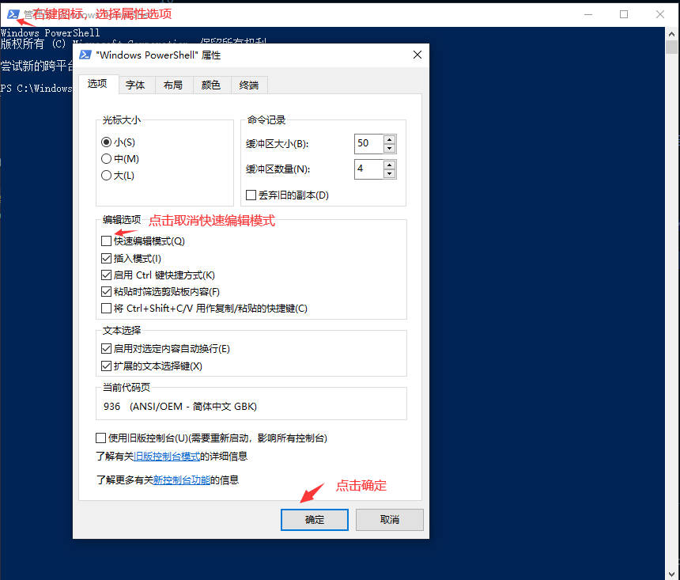

# 控制台窗口和powershell运行服务会卡住的解决办法


<!--more-->
### 问题描述

```text
  在 windows 环境下开发的时候，使用 `PowerShell` 执行 `go run main.go` 或者 `air` 等命令经常会出现程序会卡在的问题。
  这时候需要到控制台按一下回车程序才会继续往下执行。
```

### 原因和解决方法
```text
  原因：控制台开启了快速编辑模式的情况下，如果鼠标选中了文本之后就会出现这个情况。
  解决方案：关闭控制台的快速编辑模式。
  步骤：
    - 右键点击 PowerShell 左上角图标
    - 取消快速编辑模式
    - 确定
```
### 如图


