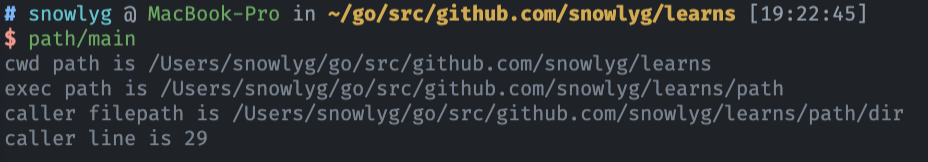
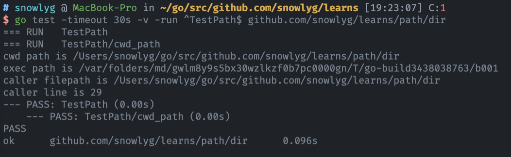

# Golang 程序中获取执行目录的几种方式


<!--more-->

#### 前言
- go 语言开发中经常需要获取程序执行目录，比如需要加载配置文件，写入调试，错误日志等情况的时候。
- go 程序在开发环境，生产环境，测试环境下的执行目录通常是不一样的，这样会导致不同情况下获取程序执行目录会变得比较麻烦。
- 接下来将要介绍 go 语言中几种常用的获取目录的几种方法，并介绍它们的相关特性。
  
#### os.Getwd() 返回相对当前目录之一的根路径

```go
func GetCWD() string {
	cwd, _ := os.Getwd()
	return cwd
}
```


#### os.Executable() 返回当前进程的可执行文件绝对路径。路径会包含执行文件的名称,配合 filepath.Dir() 返回执行文件所在目录。

```go
func GetExec() string {
	exePath, _ := os.Executable()
	exePath, _ := os.Executable()
}
```


#### os.TempDir() 返回存放临时文件的默认路径

```go
func GetTempDir() string {
	return os.TempDir()
}
```


#### runtime.Caller 返回有关调用 goroutine 堆栈上的函数调用的文件和行号信息
```go
// 返回有关调用 goroutine 堆栈上的函数调用的文件和行号信息
func GetCaller() (string, int) {
	_, filename, line, ok := runtime.Caller(0)
	if ok {
		return path.Dir(filename), line
	}
	return "", 0
}
```

#### main.go 完整代码 []()
```go
package main

import (
	"fmt"

	"github.com/snowlyg/learns/path/dir"
)

func main() {
	fmt.Printf("cwd path is %s\n", dir.GetCWD())
	fmt.Printf("exec path is %s\n", dir.GetExec())
	path, line := dir.GetCaller()
	fmt.Printf("caller filepath is %s\ncaller line is %d\n", path, line)
}

```

#### dir/dir.go
```go
// 返回相对当前目录之一的根路径
func GetCWD() string {
	cwd, _ := os.Getwd()
	return cwd
}

// 返回当前进程的可执行文件绝对路径
func GetExec() string {
	exePath, _ := os.Executable()
	return filepath.Dir(exePath)
}

// 返回存放临时文件的默认路径
func GetTempDir() string {
	return os.TempDir()
}

// 返回有关调用 goroutine 堆栈上的函数调用的文件和行号信息
func GetCaller() (string, int) {
	_, filename, line, ok := runtime.Caller(0)
	if ok {
		return path.Dir(filename), line
	}
	return "", 0
}
```

```go
package dir

import (
	"testing"

	"fmt"
)

func TestPath(t *testing.T) {
	t.Run("cwd path", func(t *testing.T) {
		fmt.Printf("cwd path is %s\n", GetCWD())
		fmt.Printf("exec path is %s\n", GetExec())
		path, line := GetCaller()
		fmt.Printf("caller filepath is %s\ncaller line is %d\n", path, line)
	})
}

```

#### 接下来我们看下不同模式下，各个方法返回的数据
- 执行目录是 `/Users/snowlyg/go/src/github.com/snowlyg/learns`，执行 `go run path/main.go`
  

- 执行目录是 `/Users/snowlyg/go/src/github.com/snowlyg/learns`，执行 `go build -o path/main path/main.go`,然后执行 path/main 执行文件
  

- 执行目录是 `/Users/snowlyg/go/src/github.com/snowlyg/learns`，执行 `go test -timeout 30s -v -run ^TestPath$ github.com/snowlyg/learns/path/dir`
  


