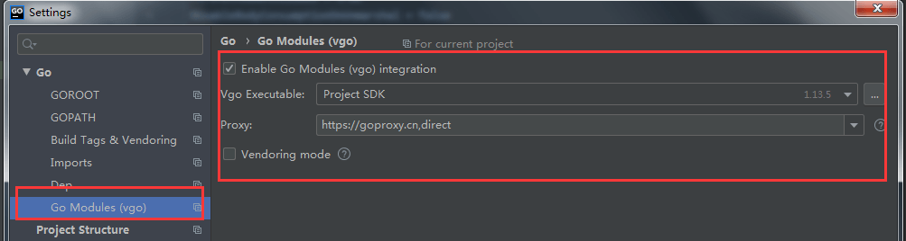
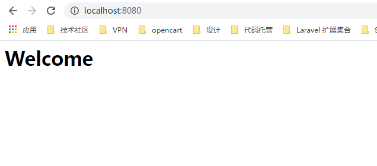
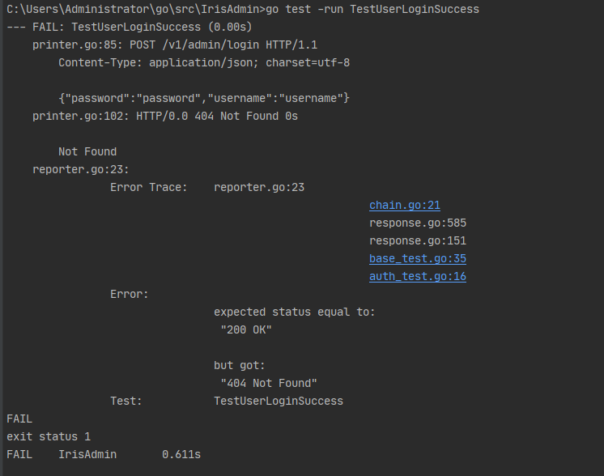
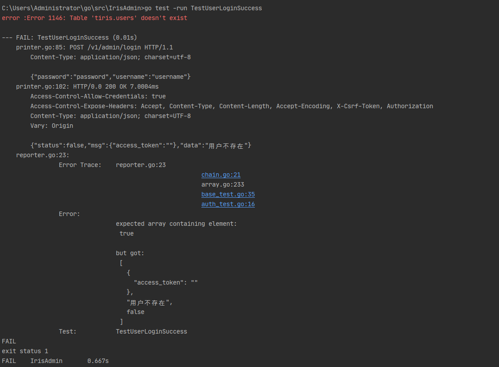
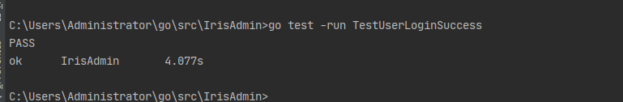
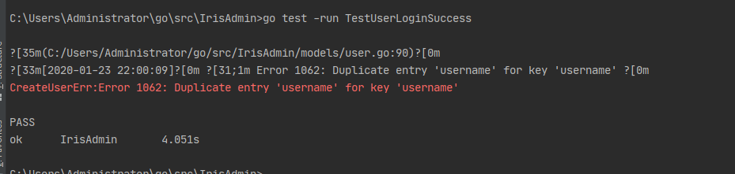

# iris-go框架构建登陆api项目开发详解


<!--more-->

具体项目实例 [https://github.com/snowlyg/IrisAdminApi](https://github.com/snowlyg/IrisAdminApi)
相关文章： [iris + casbin 从陌生到学会使用的过程](https://blog.snowlyg.com/iris-go-api-2)

很多新手学习 iris-go 的时候，看文档会觉得有些零散。而且英文文档对有些小伙伴来说还是有些吃力，就算用上翻译软件有些地方也会翻译的生涩难以理解。这篇文章主要会详细的讲解一下，我在写一个小项目的实现过程。本人功力有限，如果有错误地方，希望大家友善的指出。

##### 前言
- 首先需要安装 `golang` 环境 。具体安装教程可以查看 [Go 入门指南](https://learnku.com/docs/the-way-to-go)
- 本地安装 `mysql` 或者 `gcc` (sqlite3) 环境 。[gcc 下载地址](http://mingw-w64.org/doku.php/download)  建议下载解压版本，安装版本下载会比较慢。
- 开启 `GO111MODULE` 模式，设置镜像
```sh
go env -w GO111MODULE=on
go env -w GOPROXY=https://goproxy.cn,direct
```
- 初始化 `go.mod` 文件 
```sh
go mod init
```
- 安装 `gowatch`  ，类似  `bee run ` 的一个工具。
```sh
go get github.com/silenceper/gowatch
```

> 注意：如果是使用 goland Ide , 需要在 goland 的设置中为每一个项目单独开启 go moudels , 并且设置镜像地址，如下图。



##### 新建项目
- 在 go/src/ (GOPATH) 目录下新建文件夹 `IrisAdminApi `，并新建 `main.go` 文件。官方文档例子 https://iris-go.com/start/#installation。
```go
package main
import (
	"github.com/kataras/iris/v12"
	"github.com/kataras/iris/v12/middleware/logger"
	"github.com/kataras/iris/v12/middleware/recover"
)
func main(){
	app := iris.New()
	app.Logger().SetLevel("debug")
	//可选的, 增加两个内置的处理程序
	// 一个可以让程序从任意的 http-relative panics 中恢复过来，
	// 一个可以记录日志到终端。
	app.Use(recover.New())
	app.Use(logger.New())
	// Method:   GET
	// Resource: http://localhost:8080
	app.Handle("GET", "/", func(ctx iris.Context) {
		ctx.HTML("<h1>Welcome</h1>")
	})
	// same as app.Handle("GET", "/ping", [...])
	// Method:   GET
	// Resource: http://localhost:8080/ping
	app.Get("/ping", func(ctx iris.Context) {
		ctx.WriteString("pong")
	})
	// Method:   GET
	// Resource: http://localhost:8080/hello
	app.Get("/hello", func(ctx iris.Context) {
		ctx.JSON(iris.Map{"message": "Hello Iris!"})
	})
	// http://localhost:8080
	// http://localhost:8080/ping
	// http://localhost:8080/hello
	app.Run(iris.Addr(":8080"), iris.WithoutServerError(iris.ErrServerClosed))
}
```
-  加载相关包 `go mod tidy`,此时 `go.mod` 和 `go.sum` 会加载包的相关信息。
```
// go.mod
module IrisAdmin
go 1.13
require (
	github.com/CloudyKit/fastprinter v0.0.0-20200109182630-33d98a066a53 // indirect
	github.com/ajg/form v1.5.1 // indirect
	github.com/fasthttp-contrib/websocket v0.0.0-20160511215533-1f3b11f56072 // indirect
	github.com/google/go-querystring v1.0.0 // indirect
	github.com/imkira/go-interpol v1.1.0 // indirect
	github.com/k0kubun/colorstring v0.0.0-20150214042306-9440f1994b88 // indirect
	github.com/kataras/iris/v12 v12.1.4
	github.com/mattn/go-colorable v0.1.4 // indirect
	github.com/modern-go/concurrent v0.0.0-20180306012644-bacd9c7ef1dd // indirect
	github.com/modern-go/reflect2 v1.0.1 // indirect
	github.com/moul/http2curl v1.0.0 // indirect
	github.com/onsi/ginkgo v1.11.0 // indirect
	github.com/onsi/gomega v1.8.1 // indirect
	github.com/sergi/go-diff v1.1.0 // indirect
	github.com/shurcooL/sanitized_anchor_name v1.0.0 // indirect
	github.com/smartystreets/goconvey v1.6.4 // indirect
	github.com/valyala/fasthttp v1.8.0 // indirect
	github.com/xeipuuv/gojsonschema v1.2.0 // indirect
	github.com/yalp/jsonpath v0.0.0-20180802001716-5cc68e5049a0 // indirect
	github.com/yudai/gojsondiff v1.0.0 // indirect
	github.com/yudai/golcs v0.0.0-20170316035057-ecda9a501e82 // indirect
	github.com/yudai/pp v2.0.1+incompatible // indirect
)
```
- 启动项目 ，在项目目录运行 `gowatch`  或者 `go run main.go`。
- 输入 http://localhost:8080 ，得到如下显示就表启动成功了。




##### 实现登陆，退出功能
- 到现在我们只是实现了一个简单的 web 服务器，和几个简单的接口。接下来我们要来实现网站的基本功能登陆和退出。
- 这里我们使用单元测试驱动开发相关接口，这样做的我们的项目后期的维护会变得相对容易一些。
- 首先要修改我们的 main.go 文件，新建一个 NewApp 方法，这个方法返回-个 *iris.Application ，这个是 iris.Application 的一个指针。（具体为什么是指针，这里就不详细讲解了。可以去看下  [Go 入门指南]https://learnku.com/docs/the-way-to-go ），这个方法在单元测试会用到。
```go
package main
import (
	"github.com/kataras/iris/v12"
	"github.com/kataras/iris/v12/middleware/logger"
	"github.com/kataras/iris/v12/middleware/recover"
)
func main(){
	app := NewApp()
	// http://localhost:8080
	// http://localhost:8080/ping
	// http://localhost:8080/hello
	app.Run(iris.Addr(":8080"), iris.WithoutServerError(iris.ErrServerClosed))
}
func NewApp() *iris.Application {
	app := iris.New()
	app.Logger().SetLevel("debug")
	// Optionally, add two built'n handlers
	// that can recover from any http-relative panics
	// and log the requests to the terminal.
	app.Use(recover.New())
	app.Use(logger.New())
	// Method:   GET
	// Resource: http://localhost:8080
	app.Handle("GET", "/", func(ctx iris.Context) {
		ctx.HTML("<h1>Welcome</h1>")
	})
	// same as app.Handle("GET", "/ping", [...])
	// Method:   GET
	// Resource: http://localhost:8080/ping
	app.Get("/ping", func(ctx iris.Context) {
		ctx.WriteString("pong")
	})
	// Method:   GET
	// Resource: http://localhost:8080/hello
	app.Get("/hello", func(ctx iris.Context) {
		ctx.JSON(iris.Map{"message": "Hello Iris!"})
	})
	return app
}
```
- 在项目目录下新建测试文件 base_test.go` ，测试文件都以 _test.go 结尾。
```go
package main
import (
	"flag"
	"os"
	"testing"
	"github.com/gavv/httpexpect"
	"github.com/kataras/iris/v12"
	"github.com/kataras/iris/v12/httptest"
)
const baseUrl = "/v1/admin/"
const loginUrl = baseUrl + "login" // 登陆接口地址
var (
	app   *iris.Application 
)
//单元测试基境
func TestMain(m *testing.M) {
	// 初始化app
	app = NewApp()
	flag.Parse()
	exitCode := m.Run()
	os.Exit(exitCode)
}
// 单元测试 login 方法
func login(t *testing.T, Object interface{}, StatusCode int, Status bool, Msg string) (e *httpexpect.Expect) {
	e = httptest.New(t, app, httptest.Configuration{Debug: true})
	e.POST(loginUrl).WithJSON(Object).Expect().Status(StatusCode).JSON().Object().Values().Contains(Status, Msg)
	return
}
```

- 在项目目录下新建测试文件 `auth_test.go` 。
```go
package main
import (
   "testing"
 "github.com/kataras/iris/v12")
//登陆成功
func TestUserLoginSuccess(t *testing.T) {
   oj := map[string]string{
      "username": "username",
  "password": "password",
  }
   login(t, oj, iris.StatusOK, true, "登陆成功")
}
```

- 运行单元测试 `go test -run TestUserLoginSuccess`  单独执行登陆成功测试。得到如下错误：



- 为什么会报错，从报错信息我们知道本来要得到 200 的状态码，结果返回了 404 。因为我们没有定义登陆的路由。这里我们使用 gorm 包来管理数据，并使用 jwt 作为接口认证方式。
- 新建 user 模型，token 模型并实现相关方法。
- 新建数据库 iris , tiris 。这里要注意数据库的字符集要修改为 utf-8 ，不然会出中文乱码的情况。
- 引入了三个新的依赖包 
```
	"github.com/iris-contrib/middleware/jwt"
	"github.com/jameskeane/bcrypt"
	"github.com/jinzhu/gorm"
	_ "github.com/jinzhu/gorm/dialects/mysql"
```
- 增加 跨域中间件 和 jwt 认证中间件
- 完整代码如下

```go
package main

import (
   "errors"
 "fmt" "net/http" "os" "strconv" "strings" "time"
 "github.com/fatih/color" "github.com/kataras/iris/v12/context"
 "github.com/kataras/iris/v12"
 "github.com/iris-contrib/middleware/cors" "github.com/iris-contrib/middleware/jwt" "github.com/jameskeane/bcrypt" "github.com/jinzhu/gorm"  _ "github.com/jinzhu/gorm/dialects/mysql"
 "github.com/kataras/iris/v12/middleware/logger" "github.com/kataras/iris/v12/middleware/recover"  _ "github.com/mattn/go-sqlite3"
)

var Db *gorm.DB
var err error
var dirverName string
var conn string

// 用户数据模型
type User struct {
   gorm.Model

  Name     string `gorm:"not null VARCHAR(191)"`
  Username string `gorm:"unique;VARCHAR(191)"`
  Password string `gorm:"not null VARCHAR(191)"`
}

// 接口返回数据对想
type Response struct {
   Status bool `json:"status"` //接口状态 true ,false  Msg    interface{} `json:"msg"` // 接口信息
  Data   interface{} `json:"data"` //接口数据
}

// token 数据模型
type OauthToken struct {
   gorm.Model

  Token     string `gorm:"not null default '' comment('Token') VARCHAR(191)"`
  UserId    uint `gorm:"not null default '' comment('UserId') VARCHAR(191)"`
  Secret    string `gorm:"not null default '' comment('Secret') VARCHAR(191)"`
  ExpressIn int64 `gorm:"not null default 0 comment('是否是标准库') BIGINT(20)"`
  Revoked   bool
}

// 创建 token
func (ot *OauthToken) OauthTokenCreate() (response Token) {
   Db.Create(ot)
   response = Token{ot.Token}

   return
}

type Token struct {
   Token string `json:"access_token"`
}

// 判断数据库是否返回 ErrRecordNotFound ，如果是说明数据库没有相关记录。
func IsNotFound(err error) {
   if ok := errors.Is(err, gorm.ErrRecordNotFound); !ok && err != nil {
      color.Red(fmt.Sprintf("error :%v \n ", err))
   }
}

// 根据用户名查询用户
func UserAdminCheckLogin(username string) *User {
   user := new(User)
   IsNotFound(Db.Where("username = ?", username).First(user).Error)

   return user
}

// 登陆处理程序
func UserLogin(ctx iris.Context) {
   aul := new(User)
   if err := ctx.ReadJSON(&aul); err != nil {
      ctx.StatusCode(iris.StatusOK)
      _, _ = ctx.JSON(Response{Status: false, Msg: nil, Data: "请求参数错误"})
      return
  }

   ctx.StatusCode(iris.StatusOK)
   response, status, msg := CheckLogin(aul.Username, aul.Password)
   _, _ = ctx.JSON(Response{Status: status, Msg: response, Data: msg})
   return

}

// 检查登陆用户，并生成登陆凭证 token
func CheckLogin(username, password string) (response Token, status bool, msg string) {
   user := UserAdminCheckLogin(username)
   if user.ID == 0 {
      msg = "用户不存在"
  return
  } else {
      if ok := bcrypt.Match(password, user.Password); ok {

         token := jwt.NewTokenWithClaims(jwt.SigningMethodHS256, jwt.MapClaims{
            "exp": time.Now().Add(time.Hour * time.Duration(1)).Unix(),
  "iat": time.Now().Unix(),
  })
         tokenString, _ := token.SignedString([]byte("HS2JDFKhu7Y1av7b"))

         oauthToken := new(OauthToken)
         oauthToken.Token = tokenString
         oauthToken.UserId = user.ID
         oauthToken.Secret = "secret"
  oauthToken.Revoked = false
  oauthToken.ExpressIn = time.Now().Add(time.Hour * time.Duration(1)).Unix()
         oauthToken.CreatedAt = time.Now()

         response = oauthToken.OauthTokenCreate()
         status = true
  msg = "登陆成功"

  return

  } else {
         msg = "用户名或密码错误"
  return
  }
   }
}

// 作废token
func UpdateOauthTokenByUserId(userId uint) (ot *OauthToken) {
   Db.Model(ot).Where("revoked = ?", false).
      Where("user_id = ?", userId).
      Updates(map[string]interface{}{"revoked": true})
   return
}

// 登出用户
func UserAdminLogout(userId uint) bool {
   ot := UpdateOauthTokenByUserId(userId)
   return ot.Revoked
}

// 登出
func UserLogout(ctx iris.Context) {
   aui := ctx.Values().GetString("auth_user_id")
   id, _ := strconv.Atoi(aui)
   UserAdminLogout(uint(id))

   ctx.StatusCode(http.StatusOK)
   _, _ = ctx.JSON(Response{true, nil, "退出"})
}

//获取程序运行环境
// 根据程序运行路径后缀判断
//如果是 test 就是测试环境
func isTestEnv() bool {
   files := os.Args
   for _, v := range files {
      if strings.Contains(v, "test") {
         return true
  }
   }
   return false
}

// 接口跨域处理
func CrsAuth() context.Handler {
   return cors.New(cors.Options{
      AllowedOrigins:   []string{"*"}, // allows everything, use that to change the hosts.
  AllowedMethods:   []string{"PUT", "PATCH", "GET", "POST", "OPTIONS", "DELETE"},
  AllowedHeaders:   []string{"*"},
  ExposedHeaders:   []string{"Accept", "Content-Type", "Content-Length", "Accept-Encoding", "X-CSRF-Token", "Authorization"},
  AllowCredentials: true,
  })

}

// 获取 access_token 信息
func GetOauthTokenByToken(token string) (ot *OauthToken) {
   ot = new(OauthToken)
   Db.Where("token =  ?", token).First(&ot)
   return
}

/**
 * 验证 jwt * @method JwtHandler */
 func JwtHandler() *jwt.Middleware {
   var mySecret = []byte("HS2JDFKhu7Y1av7b")
   return jwt.New(jwt.Config{
      ValidationKeyGetter: func(token *jwt.Token) (interface{}, error) {
         return mySecret, nil
  },
  SigningMethod: jwt.SigningMethodHS256,
  })
}

func AuthToken(ctx context.Context) {
   value := ctx.Values().Get("jwt").(*jwt.Token)
   token := GetOauthTokenByToken(value.Raw) //获取 access_token 信息
  if token.Revoked || token.ExpressIn < time.Now().Unix() {
      //_, _ = ctx.Writef("token 失效，请重新登录") // 输出到前端
  ctx.StatusCode(http.StatusUnauthorized)
      ctx.StopExecution()
      return
  } else {
      ctx.Values().Set("auth_user_id", token.UserId)
   }

   ctx.Next()
}

func NewApp() *iris.Application {

   dirverName = "mysql"
  if isTestEnv() { //如果是测试使用测试数据库
  conn = "root:wemT5ZNuo074i4FNsTwl4KhfVSvOlBcF@(127.0.0.1:3306)/tiris?charset=utf8&parseTime=True&loc=Local"
  } else {
      conn = "root:wemT5ZNuo074i4FNsTwl4KhfVSvOlBcF@(127.0.0.1:3306)/iris?charset=utf8&parseTime=True&loc=Local"
  }

   //初始化数据库
  Db, err = gorm.Open(dirverName, conn)
   if err != nil {
      color.Red(fmt.Sprintf("gorm open 错误: %v", err))
   }

   app := iris.New()
   app.Logger().SetLevel("debug")

   app.Use(recover.New())
   app.Use(logger.New())

   // 路由集使用跨域中间件 CrsAuth() 
   // 允许 Options 方法 AllowMethods(iris.MethodOptions)
main := app.Party("/", CrsAuth()).AllowMethods(iris.MethodOptions)
   {
      v1 := main.Party("/v1")
      {
         v1.Post("/admin/login", UserLogin)
         v1.PartyFunc("/admin", func(admin iris.Party) {
            admin.Use(JwtHandler().Serve, AuthToken) //登录验证
  admin.Get("/logout", UserLogout).Name = "退出"
  })
      }
   }

   return app
}

func main() {
   app := NewApp()
   app.Run(iris.Addr(":8080"), iris.WithoutServerError(iris.ErrServerClosed))
}

```
- 这时候再执行测试命令 `go test -run TestUserLoginSuccess` 我们会得到如下错误：




- 现在已经不再是 404 的错误了， 而是返回一个用户不存在的信息。原因是虽然我们增加了路由已经一系列的相关代码 
- 但是数据库并没有用户数据 ，我们自然无法查询到任何用户信息。
- 那么要如何解决这问题呢？
- 同时你会发现到现在的 main.go 文件非常庞大臃肿，无论是修改代码，还是追踪错误都是非常麻烦。应该如何调整？
- 前文讲到 权限控制又该如何实现？

##### 重构项目结构

- 现在我们调整文件代码，划分项目结构如下
- controllers // 控制器
	- access.go 
```
	package controllers
import (
	"net/http"
	"strconv"
	"IrisAdmin/models"
	"github.com/kataras/iris/v12"
)
// 登陆处理程序
func UserLogin(ctx iris.Context) {
	aul := new(models.User)
	if err := ctx.ReadJSON(&aul); err != nil {
		ctx.StatusCode(iris.StatusOK)
		_, _ = ctx.JSON(models.Response{Status: false, Msg: nil, Data: "请求参数错误"})
		return
	}
	ctx.StatusCode(iris.StatusOK)
	response, status, msg := models.CheckLogin(aul.Username, aul.Password)
	_, _ = ctx.JSON(models.Response{Status: status, Msg: response, Data: msg})
	return
}
// 登出
func UserLogout(ctx iris.Context) {
	aui := ctx.Values().GetString("auth_user_id")
	id, _ := strconv.Atoi(aui)
	models.UserAdminLogout(uint(id))
	ctx.StatusCode(http.StatusOK)
	_, _ = ctx.JSON(models.Response{true, nil, "退出"})
}
```
- middleware // 中间件
 	- auth.go  // 验证登陆
```go
package middleware
import (
	"net/http"
	"time"
	"IrisAdmin/models"
	"github.com/iris-contrib/middleware/jwt"
	"github.com/kataras/iris/v12/context"
)
func AuthToken(ctx context.Context) {
	value := ctx.Values().Get("jwt").(*jwt.Token)
	token := models.GetOauthTokenByToken(value.Raw) //获取 access_token 信息
	if token.Revoked || token.ExpressIn < time.Now().Unix() {
		//_, _ = ctx.Writef("token 失效，请重新登录") // 输出到前端
		ctx.StatusCode(http.StatusUnauthorized)
		ctx.StopExecution()
		return
	} else {
		ctx.Values().Set("auth_user_id", token.UserId)
	}
	ctx.Next()
}
```
 	- crs.go // 跨域认证
```go
package middleware
import (
	"github.com/iris-contrib/middleware/cors"
	"github.com/kataras/iris/v12/context"
)
func CrsAuth() context.Handler {
	return cors.New(cors.Options{
		AllowedOrigins:   []string{"*"}, // allows everything, use that to change the hosts.
		AllowedMethods:   []string{"PUT", "PATCH", "GET", "POST", "OPTIONS", "DELETE"},
		AllowedHeaders:   []string{"*"},
		ExposedHeaders:   []string{"Accept", "Content-Type", "Content-Length", "Accept-Encoding", "X-CSRF-Token", "Authorization"},
		AllowCredentials: true,
	})
}
```
 	- jwt.go // token 认证
	
```go
package middleware
import (
	"github.com/iris-contrib/middleware/jwt"
)
/**
 * 验证 jwt
 * @method JwtHandler
 */
func JwtHandler() *jwt.Middleware {
	var mySecret = []byte("HS2JDFKhu7Y1av7b")
	return jwt.New(jwt.Config{
		ValidationKeyGetter: func(token *jwt.Token) (interface{}, error) {
			return mySecret, nil
		},
		SigningMethod: jwt.SigningMethodHS256,
	})
}
```
- models // 模型
 	- base.go  // 初始化数据库，公共方法
 	
```go
package models
import (
	"errors"
	"fmt"
	"os"
	"strings"
	"github.com/fatih/color"
	"github.com/jinzhu/gorm"
	_ "github.com/jinzhu/gorm/dialects/mysql"
	_ "github.com/mattn/go-sqlite3"
)
var Db *gorm.DB
var err error
var dirverName string
var conn string
/**
*设置数据库连接
*@param diver string
 */
func Register() {
	dirverName = "mysql"
	if isTestEnv() { //如果是测试使用测试数据库
		conn = "root:wemT5ZNuo074i4FNsTwl4KhfVSvOlBcF@(127.0.0.1:3306)/tiris?charset=utf8&parseTime=True&loc=Local"
	} else {
		conn = "root:wemT5ZNuo074i4FNsTwl4KhfVSvOlBcF@(127.0.0.1:3306)/iris?charset=utf8&parseTime=True&loc=Local"
	}
	//初始化数据库
	Db, err = gorm.Open(dirverName, conn)
	if err != nil {
		color.Red(fmt.Sprintf("gorm open 错误: %v", err))
	}
}
func IsNotFound(err error) {
	if ok := errors.Is(err, gorm.ErrRecordNotFound); !ok && err != nil {
		color.Red(fmt.Sprintf("error :%v \n ", err))
	}
}
//获取程序运行环境
// 根据程序运行路径后缀判断
//如果是 test 就是测试环境
func isTestEnv() bool {
	files := os.Args
	for _, v := range files {
		if strings.Contains(v, "test") {
			return true
		}
	}
	return false
}
// 接口返回数据对想
type Response struct {
	Status bool        `json:"status"` //接口状态 true ,false
	Msg    interface{} `json:"msg"`    // 接口信息
	Data   interface{} `json:"data"`   //接口数据
}
```
 - token.go // token模型
		
```go
package models
import "github.com/jinzhu/gorm"
// token 数据模型
type OauthToken struct {
	gorm.Model
	Token     string `gorm:"not null default '' comment('Token') VARCHAR(191)"`
	UserId    uint   `gorm:"not null default '' comment('UserId') VARCHAR(191)"`
	Secret    string `gorm:"not null default '' comment('Secret') VARCHAR(191)"`
	ExpressIn int64  `gorm:"not null default 0 comment('是否是标准库') BIGINT(20)"`
	Revoked   bool
}
// 创建 token
func (ot *OauthToken) OauthTokenCreate() (response Token) {
	Db.Create(ot)
	response = Token{ot.Token}
	return
}
type Token struct {
	Token string `json:"access_token"`
}
// 获取 access_token 信息
func GetOauthTokenByToken(token string) (ot *OauthToken) {
	ot = new(OauthToken)
	Db.Where("token =  ?", token).First(&ot)
	return
}
```
 - user.go // 用户模型
	
```go
package models
import (
	"time"
	"github.com/iris-contrib/middleware/jwt"
	"github.com/jameskeane/bcrypt"
	"github.com/jinzhu/gorm"
)
// 用户数据模型
type User struct {
	gorm.Model
	Name     string `gorm:"not null VARCHAR(191)"`
	Username string `gorm:"unique;VARCHAR(191)"`
	Password string `gorm:"not null VARCHAR(191)"`
}
// 根据用户名查询用户
func UserAdminCheckLogin(username string) *User {
	user := new(User)
	IsNotFound(Db.Where("username = ?", username).First(user).Error)
	return user
}
// 检查登陆用户，并生成登陆凭证 token
func CheckLogin(username, password string) (response Token, status bool, msg string) {
	user := UserAdminCheckLogin(username)
	if user.ID == 0 {
		msg = "用户不存在"
		return
	} else {
		if ok := bcrypt.Match(password, user.Password); ok {
			token := jwt.NewTokenWithClaims(jwt.SigningMethodHS256, jwt.MapClaims{
				"exp": time.Now().Add(time.Hour * time.Duration(1)).Unix(),
				"iat": time.Now().Unix(),
			})
			tokenString, _ := token.SignedString([]byte("HS2JDFKhu7Y1av7b"))
			oauthToken := new(OauthToken)
			oauthToken.Token = tokenString
			oauthToken.UserId = user.ID
			oauthToken.Secret = "secret"
			oauthToken.Revoked = false
			oauthToken.ExpressIn = time.Now().Add(time.Hour * time.Duration(1)).Unix()
			oauthToken.CreatedAt = time.Now()
			response = oauthToken.OauthTokenCreate()
			status = true
			msg = "登陆成功"
			return
		} else {
			msg = "用户名或密码错误"
			return
		}
	}
}
// 作废token
func UpdateOauthTokenByUserId(userId uint) (ot *OauthToken) {
	Db.Model(ot).Where("revoked = ?", false).
		Where("user_id = ?", userId).
		Updates(map[string]interface{}{"revoked": true})
	return
}
// 登出用户
func UserAdminLogout(userId uint) bool {
	ot := UpdateOauthTokenByUserId(userId)
	return ot.Revoked
}
```
- routers // 路由
 	- router.go 
```go
package routers
import (
	"IrisAdmin/controllers"
	"IrisAdmin/middleware"
	"github.com/kataras/iris/v12"
)
func Register(app *iris.Application) {
	// 路由集使用跨域中间件 CrsAuth()
	// 允许 Options 方法 AllowMethods(iris.MethodOptions)
	main := app.Party("/", middleware.CrsAuth()).AllowMethods(iris.MethodOptions)
	{
		v1 := main.Party("/v1")
		{
			v1.Post("/admin/login", controllers.UserLogin)
			v1.PartyFunc("/admin", func(admin iris.Party) {
				admin.Use(middleware.JwtHandler().Serve, middleware.AuthToken) //登录验证
				admin.Get("/logout",  controllers.UserLogout).Name = "退出"
			})
		}
	}
}
```
- auth_test.go // 单元测试
```go
package main
import (
	"testing"
	"github.com/kataras/iris/v12"
)
//登陆成功
func TestUserLoginSuccess(t *testing.T) {
	oj := map[string]string{
		"username": "username",
		"password": "password",
	}
	login(t, oj, iris.StatusOK, true, "登陆成功")
}
// 输入不存在的用户名登陆
func TestUserLoginWithErrorName(t *testing.T) {
	oj := map[string]string{
		"username": "err_user",
		"password": "password",
	}
	login(t, oj, iris.StatusOK, false, "用户不存在")
}
// 输入错误的登陆密码
func TestUserLoginWithErrorPwd(t *testing.T) {
	oj := map[string]string{
		"username": "username",
		"password": "admin",
	}
	login(t, oj, iris.StatusOK, false, "用户名或密码错误")
}
// 输入登陆密码格式错误
func TestUserLoginWithErrorFormtPwd(t *testing.T) {
	oj := map[string]string{
		"username": "username",
		"password": "123",
	}
	login(t, oj, iris.StatusOK, false, "密码格式错误")
}
// 输入登陆密码格式错误
func TestUserLoginWithErrorFormtUserName(t *testing.T) {
	oj := map[string]string{
		"username": "df",
		"password": "123",
	}
	login(t, oj, iris.StatusOK, false, "用户名格式错误")
}
```
-  base_test.go
```go
package main
import (
	"flag"
	"os"
	"testing"
	"github.com/gavv/httpexpect"
	"github.com/kataras/iris/v12"
	"github.com/kataras/iris/v12/httptest"
)
const baseUrl = "/v1/admin/" // 接口地址
const loginUrl = baseUrl + "login" // 登陆接口地址
var (
	app   *iris.Application 
)
//单元测试基境
func TestMain(m *testing.M) {
	// 初始化app
	app = NewApp()
	flag.Parse()
	exitCode := m.Run()
	os.Exit(exitCode)
}
// 单元测试 login 方法
func login(t *testing.T, Object interface{}, StatusCode int, Status bool, Msg string) (e *httpexpect.Expect) {
	e = httptest.New(t, app, httptest.Configuration{Debug: true})
	e.POST(loginUrl).WithJSON(Object).Expect().Status(StatusCode).JSON().Object().Values().Contains(Status, Msg)
	return
}
```
-  main.go 
```go
package main
import (
	"IrisAdmin/models"
	"IrisAdmin/routers"
	"github.com/kataras/iris/v12"
	_ "github.com/jinzhu/gorm/dialects/mysql"
	"github.com/kataras/iris/v12/middleware/logger"
	"github.com/kataras/iris/v12/middleware/recover"
	_ "github.com/mattn/go-sqlite3"
)
func NewApp() *iris.Application {
	models.Register() // 数据库初始化
	models.Db.AutoMigrate(
		&models.User{},
		&models.OauthToken{},
	)
	iris.RegisterOnInterrupt(func() {
		_ = models.Db.Close()
	})
	app := iris.New()
	app.Logger().SetLevel("debug") //设置日志级别
	app.Use(recover.New())
	app.Use(logger.New())
	routers.Register(app) // 注册路由
	return app
}
func main() {
	app := NewApp()
	app.Run(iris.Addr(":8080"), iris.WithoutServerError(iris.ErrServerClosed))
}
```

- 到此，登陆的接口基本完成。
- 但是还有很多问题没有解决，比如重复启动项目或者执行测试会得到如下提示，虽然测试还是通过，却会同时有一个报错。
- 原因是 `main.go` 中  `models.CreateUser()` 方法每次启动，测试都会重复执行。但是数据已经有的数据虽有会报错，数据已经存在的错误。
- 要解决的方法也很简单，直接注释  `models.CreateUser()` 方法即可。
- 同时还有更好的解决方法，判断数据库是否存在数据，如果存在就不保存新数据。
- 单元测试则可以在每次单元测试后摧毁数据，这样可以防止多个单元测试的数据相互污染，导致测试结果和预期结果不符合。



