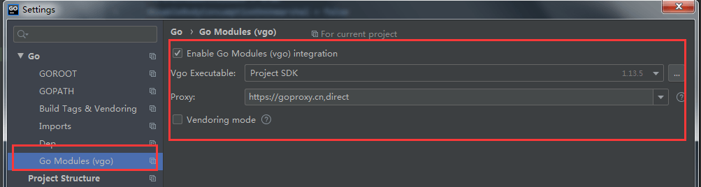

# PHP 转 GO 新手问题汇总


<!--more-->

- 本文就是个人的一点学习经验，如果有表述错误的地方欢迎指正。
- 越来越多的朋友从 php 语言转入到 go 语言的学习中来。那么新手转 go 会遇到很多问题和瓶颈。
- 这个主要是很多朋友，并不知道从何入手学习这门新语言。而且大部分都会带着以前 php 的一些思维来学习。
- 我总结了一些常见的问题，并结合我自己的开源项目 [IrisAdminApi](https://www.github.com/snowlyg/IrisAdminApi) 对这些问题做一些阐述， 希望能对 go 的初学者们能有一些帮助。
 

* GO 语言 和 PHP有什么区别？
* 如何启动一个 GO 程序？
* 为什么开发的时候要用热编译工具？什么是热编译工具？
* 为什么热编译工具安装后，还是会提示 command not found?
* 启动程序为什么会提示方法或者变量不存在？但是使用热编译工具又可以正常运行？
* 如何使用 ide , 比如 Goland 开发 GO 程序？
* 如何部署一个 GO 项目？

### GO 语言 和 PHP 有什么区别？

* PHP 脚本的生命周期及fpm(FastCGI进程管理器)的运作方式，
* 从下图可以看出 php 是动态语言，每一请求都会执行一次 php 脚本。
* 如下图：


* 然而 go 语言则完全不同，它是静态语言每次修改go脚本后，都必须重新编译才能生效。
* go 语言通常有两个命令可以编译脚本，go run main.go , go build main.go。
* go build main.go： 会在当前目录生成一个 main 可执行文件，windows 系统会生成 main.exe 可执行文件。
* go run main.go ： 编译脚本的同时还会执行脚本，不会生成可执行文件。
* 注意：每次修改脚本后都需要重新编译脚本，不管你执行的是 go run main.go，还是 go build main.go 你的修改才会生效。
* 当然 go run main.go , go build main.go 还有其他的区别，有兴趣的朋友可以自行百度。

### 如何启动一个 GO 程序？

* 可以通过 go run main.go 启动一个 go 程序。
* 也可以直接在命令行执行 ./main ,windows 系统双击 main.exe。
* 开发的时候通常会使用热编译工具：air , gowatch等等。

### 为什么开发的时候要用热编译工具？什么是热编译工具？

* 热编译工具可以在你开发 go 脚本程序的时候，在你修改代码后，自动帮你执行编译命令，并执行编译好的执行文件。
* 热编译工具的原理很简单，就是启动一个协程实时的监控你的的项目文件。当监控到项目文件被修改后，执行相关命令。

##### 为什么热编译工具安装后，还是会提示 command not found?

* 这个问题很简单，其实就是执行的命令不存在，或者存在但是系统找不到。
* 不管是什么系统都会有一套查找可执行命令的机制。通常都是通过设置系统变量来实现。
* 具体如何设置各系统的系统环境变量，这里不做介绍。
* 这里简单介绍一下如何排查自己安装的 go 工具,比如 gowatch,air 等命令执行的时候出现 command not found 的问题。
* 首先：查看一下 gopath/bin 目录下是否已经有对应的可执行文件，比如 air ，win 系统下是 air.exe 文件。如果没有说明没有安装成功，需要重新安装。
* 第二种情况：如果文件已经存在 gopath/bin 目录，还是出现 command not found 情况。那么说明你的 gopath/bin 目录，没有加入到系统环境变量。这时候有两种解决方法，第一种：直接复制执行文件到 goroot/bin 目录下。第二种：当然就是把  gopath/bin 目录加入系统环境变量了。
* 极少数情况：修改系统变量未生效，比如 windows 系统下未重启系统，linux 系统下未重启终端都有可能导致设置的系统变量不能生效。 


##### 启动程序为什么会提示方法或者变量不存在？但是使用热编译工具又可以正常运行？

* 很多文档的介绍里面都是通过 go run main.go 启动 go 脚本程序。因为大部分的文档 go 脚本实例程序都只有一个文件 main.go 。
* 当你遇到一些文件比较多的项目的时候，比如[IrisAdminApi](https://www.github.com/snowlyg/IrisAdminApi) 你会发现使用 go run main.go 会提示报错某些方法不存在。但是使用 air 热编译工具又可以正常启动程序。
* 这个原因是在 package main 这个包名下，其实有两个文件 main.go ，bindata.go。所以你需要执行 go run main.go bindata.go 才可以正常启动程序。你一定发现了原理 go run 后面是可以加多个文件的。

### 如何使用 ide , 比如 Goland 开发 GO 程序？

* 使用 goland 开发主要会遇到一个坑：它里面的每个项目的 go 环境是隔离的，并不会共用 go env 里面的设置。
* 所以新建一个项目的时候都需要设置一次 go 环境的一些参数。
* 主要是GOROOT,GOPATH,Go Modules。这几个参数 Go Modules 是用于设置依赖代理。



### 如何部署一个 GO 项目？

* 如何将一个 go 项目部署到服务器? 以 [IrisAdminApi](https://www.github.com/snowlyg/IrisAdminApi)  项目举例：

- 直接启动编译文件，通过 Supervisor , pm2 等进程守护工具辅助部署，这种方式不方便升级维护，而且部署也相对复杂。（不推荐）
- 通过 docker 方式部署，将程序打包成 docker 镜像。然后通过 docker 启动程序，这种方式方便升级维护，适合经常需要版本迭代的程序。
- 直接执行编译生成的文件

### go get ...添加私有仓库依赖时,报错 (go 1.13+ 版本)

- 设置 GOPRIVATE 变量
```
export GOPRIVATE=gitlab.com/xxx
```


